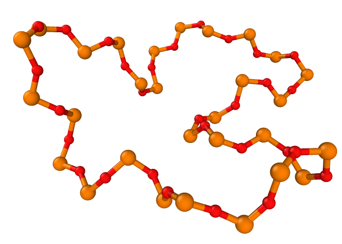

# Rings
## Introduction
This is a little Python script to find rings in atomistic structures.

It is using the ring definition according to [Guttman, L. (1990). Ring structure of the crystalline and amorphous forms of silicon dioxide. Journal of Non-Crystalline Solids, 116(2), 145-147](https://doi.org/10.1016/0022-3093(90)90686-G).
This means that rings are defined as the shortest path between two bonded atoms, excluding the direct bond.


## How to use
The function should be straight forward to use and takes the following parameters:

- `ats`: ASE atoms object for which rings should be found.
- `radii_factor`: Bonds are detected by atoms being closer than the sum of their covalent radii times this factor.
- `bonds`: Can be used to only include selected bond types in the ring calculation.
- `repeat`: In small unit cells, rings might be detected which wrap around periodically. The cell is therefore repeated internally according to this parameter to avoid this. Warnings are given if period rings are detected. They will not be returned, but it indicates that a larger ring might have been missed. 

## Example code
In `main.py` a little example script is provided that shows how to compute the ring size distribution of a given structure.

```python
from rings import find_rings
from ase.io import read, write

# Read input structure 
ats = read('test.extxyz')

# Find the rings made up of P-O and Al-O bonds
rings = find_rings(ats, radii_factor=1.3, bonds=[('P', 'O'), ('Ca', 'O')], repeat=(1, 1, 1))
print(f'Found {len(rings)} rings')

# `rings` now contains a list of index lists, identifying the atoms participating in each ring

# Create a list of structures containing only the rings
rs = []
for r in rings:
    ss = ats[r]
    rs.append(ss)

# Save it to have a look at the rings
write('rings.extxyz', rs)
```




